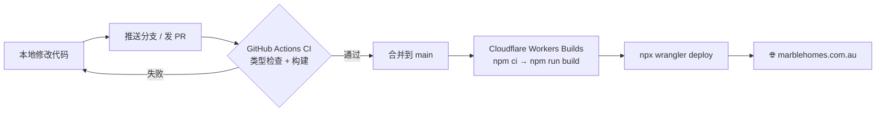

<div align="center">


# Marble Homes

**Excellence in every aspect.**

Marble Homes 官方网站 · 悉尼建筑设计、施工与项目管理

[](https://github.com/Marblehomes/marblehomes-site/actions/workflows/ci.yml)


### 🌐 [marblehomes.com.au](https://marblehomes.com.au)

</div>

---

## 目录

- [项目简介](#项目简介)
- [技术栈](#技术栈)
- [快速开始](#快速开始)
- [部署是怎么工作的](#部署是怎么工作的)
- [目录结构](#目录结构)
- [常见修改](#常见修改)
- [贡献流程](#贡献流程)
- [常见问题](#常见问题)

## 项目简介

这是 Marble Homes 的品牌官网，一个纯静态网站，没有数据库和后端服务。

| 页面 | 路径 | 说明 |
| --- | --- | --- |
| 首页 | `/` | 品牌介绍、精选项目、服务、流程、选择我们的理由 |
| 关于 | `/about/` | 公司与团队介绍 |
| 项目列表 | `/projects/` | 全部项目，可按类别筛选 |
| 项目详情 | `/projects/<slug>/` | 根据 `src/data/projects.ts` 自动生成 |
| 联系我们 | `/contact/` | 联系方式与询价表单 |

## 技术栈

| 用途 | 选型 |
| --- | --- |
| 框架 | [Astro](https://astro.build)（静态输出） |
| 动效 | [GSAP](https://gsap.com) + ScrollTrigger、[Lenis](https://lenis.darkroom.engineering) 平滑滚动 |
| 字体 | Bricolage Grotesque、Inter（`@fontsource-variable`，自托管） |
| 图片 | `astro:assets` + sharp，构建时自动压缩并生成多尺寸 |
| 托管 | Cloudflare Workers 静态资源 |
| CI | GitHub Actions |

## 快速开始

需要 **Node.js 22**（见 `.nvmrc`）。

```bash
npm ci          # 安装依赖
npm run dev     # 本地开发 → http://localhost:4321
npm run check   # 类型检查
npm run build   # 生产构建，输出到 dist/
npm run preview # 本地预览构建结果
```

## 部署是怎么工作的

> **一句话：合并到 `main` 分支就会自动上线，不需要手动操作服务器。**



- **GitHub Actions**（`.github/workflows/ci.yml`）只负责检查：每个 PR 和每次推送到 `main` 都会跑类型检查和构建。它**不负责**部署。
- **Cloudflare Workers Builds** 负责部署：Cloudflare 监听这个仓库的 `main` 分支，有新提交就自动构建，大约 1 到 2 分钟后上线。
- 部署配置在 `wrangler.jsonc`：把 `dist/` 当作静态资源发布，未知路径返回 `404.html`。
- 其他分支推送后，Cloudflare 会生成预览地址，可以在 Cloudflare 控制台的 **Workers & Pages → marblehomes-site → Deployments** 里找到。
- 回滚：在同一个 Deployments 页面，找到之前的版本，点 **Rollback**。

### 域名与 DNS

- 域名注册在 GoDaddy，DNS 托管在 Cloudflare。
- `marblehomes.com.au` 绑定为 Worker 的自定义域名。
- `www.marblehomes.com.au` 由 Cloudflare 跳转规则 301 到主域名。
- ⚠️ **DNS 里的 MX、TXT、SRV 和邮件相关 CNAME 记录服务于公司 Microsoft 365 邮箱，不要删除，也不要开启代理（橙色云朵）。**

## 目录结构

```text
marblehomes-site/
├── public/                 # 原样复制到 dist/ 的文件
│   ├── _redirects          # 旧 WordPress 网址的 301 跳转
│   └── favicon.png
├── scripts/
│   └── make-logo.mjs       # 由原始 logo 生成浅色/深色变体
├── src/
│   ├── assets/
│   │   ├── projects/       # 项目图片
│   │   └── site/           # 站点通用图片与 logo
│   ├── components/         # Header、Footer、ProjectCard
│   ├── data/
│   │   ├── site.ts         # 公司信息、导航、服务、流程等文案
│   │   └── projects.ts     # 项目数据
│   ├── layouts/Base.astro  # 页面骨架
│   ├── pages/              # 路由（文件即页面）
│   ├── scripts/main.ts     # 全站动效与交互
│   └── styles/global.css   # 设计变量与全局样式
├── astro.config.mjs
└── wrangler.jsonc          # Cloudflare 部署配置
```

## 常见修改

<details>
<summary><b>修改电话、邮箱、地址或页面文案</b></summary>

编辑 `src/data/site.ts`。所有页面都从这里读取，改一处全站生效。

</details>

<details>
<summary><b>新增一个项目</b></summary>

1. 把图片放进 `src/assets/projects/`，文件名用小写加连字符，例如 `north-ryde.jpg`。
2. 在 `src/data/projects.ts` 顶部 import 图片。
3. 在 `projects` 数组里加一行：

   ```ts
   make('north-ryde', 'North Ryde', 'New Build', 'New Build', northRyde),
   ```

4. 项目详情页 `/projects/north-ryde/` 会自动生成。数组里前 6 个项目会出现在首页。

</details>

<details>
<summary><b>修改颜色或字体</b></summary>

设计变量在 `src/styles/global.css` 顶部的 `:root` 里，例如 `--taupe`、`--cream`、`--gold`。

</details>

<details>
<summary><b>添加网址跳转</b></summary>

在 `public/_redirects` 里加一行：`旧路径  新路径  301`。带斜杠和不带斜杠的写法建议都加上。

</details>

<details>
<summary><b>更换 logo</b></summary>

替换 `src/assets/site/logo.png` 后运行 `npm run logo`，会重新生成 `logo-light.png`、`mark-light.png`、`mark-dark.png` 和 `public/favicon.png`。

</details>

## 贡献流程

1. 从 `main` 新建分支：`git checkout -b feat/简短描述`。
2. 本地确认 `npm run check` 和 `npm run build` 都通过。
3. 推送并发起 Pull Request，等待 CI 变绿。
4. 在 Cloudflare 的预览地址上检查效果。
5. Review 通过后合并到 `main`，网站自动更新。

> 使用 AI 编程工具修改代码前，请让它先阅读 [`AGENTS.md`](AGENTS.md)。

## 常见问题

<details>
<summary><b>Cloudflare 构建卡在 Installing 不动？</b></summary>

`package-lock.json` 里的依赖地址必须是公共源 `https://registry.npmjs.org/`。如果你本机配置了公司内部 npm 源，安装新依赖时会写进内部地址，Cloudflare 访问不到。项目里的 `.npmrc` 已经指定公共源，CI 也会检查这一点。

</details>

<details>
<summary><b>本地页面动画不生效、控制台报 504 Outdated Optimize Dep？</b></summary>

删除 `node_modules/.vite` 后重启 `npm run dev`。

</details>

<details>
<summary><b>合并后网站没有更新？</b></summary>

到 Cloudflare 控制台 **Workers & Pages → marblehomes-site → Deployments** 查看构建日志。浏览器可能有缓存，可以用无痕窗口确认。

</details>

---

<div align="center">
<sub>© Marble Homes · Burwood NSW 2134 · <a href="https://marblehomes.com.au">marblehomes.com.au</a></sub>
</div>
